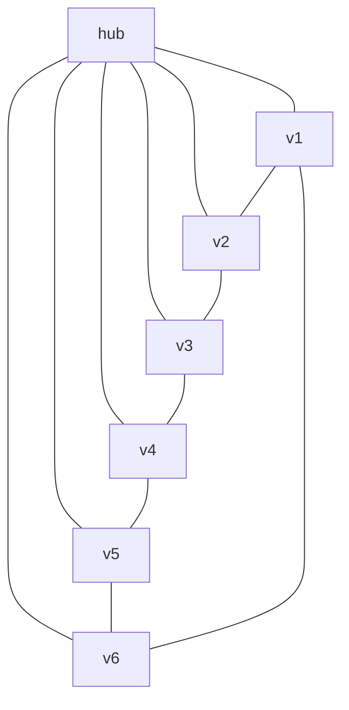
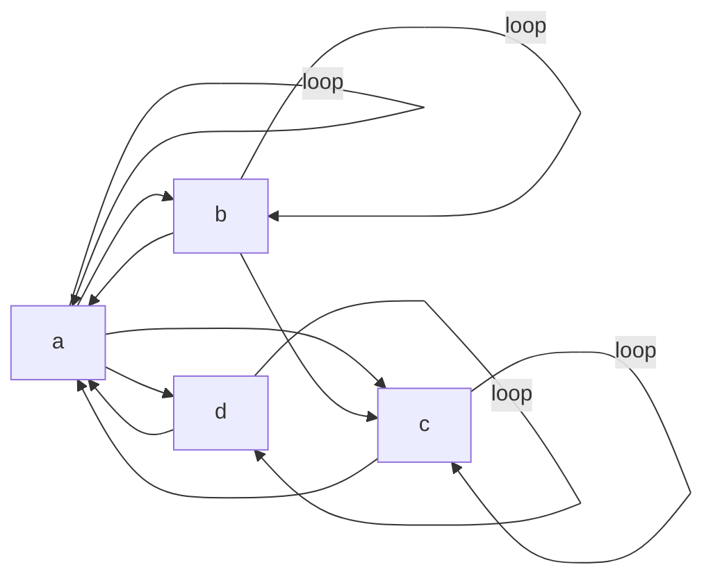
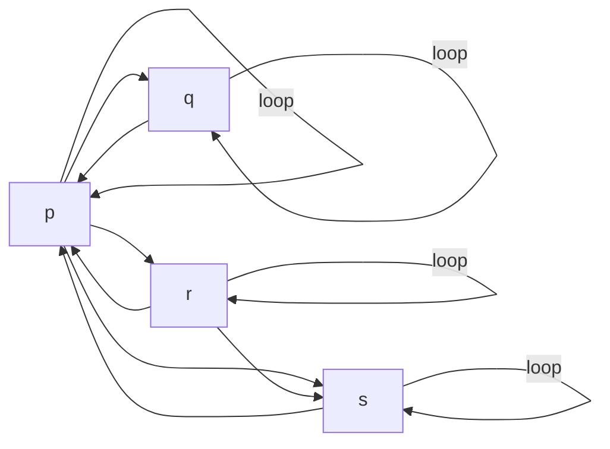
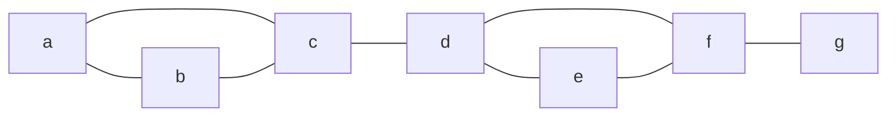
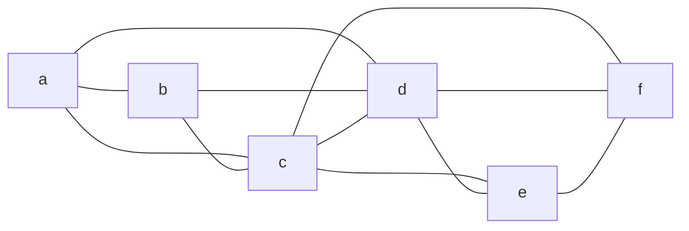
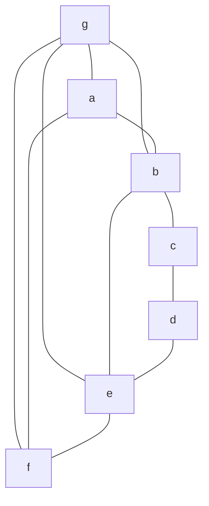
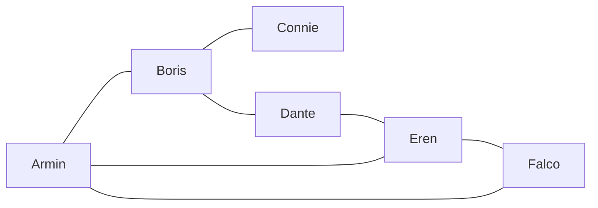
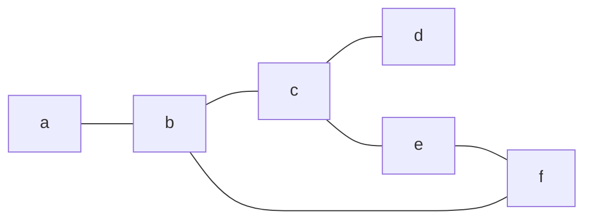
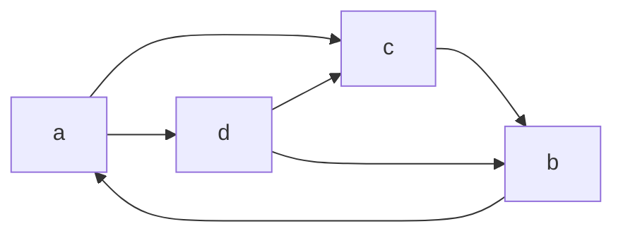
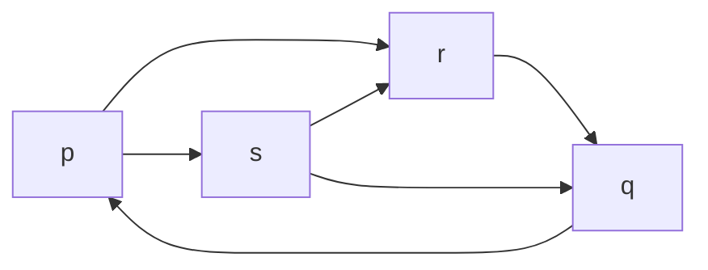

# Kumpulan Soal Graf — Isomorfisme, Bipartite & Matching, Lintasan Terpendek
**Matematika Diskret 2 — Fakultas Ilmu Komputer, Universitas Indonesia**

> Sumber: Tugas 4 Genap 2024/2025 · UAS Genap 2023/2024 · UAS SP 2024/2025

---

## Daftar Isi
1. [Tugas 4 — Soal 2: Menggambar Graf Khusus](#tugas-4--soal-2)
2. [Tugas 4 — Soal 5: Isomorfisme Graf Berarah](#tugas-4--soal-5)
3. [Tugas 4 — Soal 8: Vertex/Edge Connectivity & Cut Set](#tugas-4--soal-8)
4. [Tugas 4 — Soal 10: Bipartite & Matching](#tugas-4--soal-10)
5. [UAS Genap 2023/2024 — Soal 4: Isomorfisme (Incidence Matrix)](#uas-genap-20232024--soal-4)
6. [UAS Genap 2023/2024 — Soal 5: Bipartite & Matching (Konteks Nyata)](#uas-genap-20232024--soal-5)
7. [UAS SP 2024/2025 — Soal 4: Bipartite & Matching (Incidence Matrix)](#uas-sp-20242025--soal-4)
8. [UAS SP 2024/2025 — Soal 5: Isomorfisme Graf Berarah](#uas-sp-20242025--soal-5)

---

## Tugas 4 — Soal 2
**Topik:** Menggambar Graf Khusus (K₂,₉ · W₆ · Q₄)
**Poin:** 3 per subsoal

Gambarkan dan tuliskan jumlah vertex serta edge dari graf-graf berikut:

### a. K₂,₉ (Graf Bipartite Lengkap)

Graf bipartite lengkap dengan partisi **U** berisi 2 vertex dan **W** berisi 9 vertex. Setiap vertex di U terhubung ke semua vertex di W.

```
Struktur K₂,₉:

  u₁  u₂
  |×  ×|   (setiap uᵢ terhubung ke semua wⱼ)
  w₁ w₂ w₃ w₄ w₅ w₆ w₇ w₈ w₉
```

**Jawab:**
- **Vertex** = |U| + |W| = 2 + 9 = **11**
- **Edge** = |U| × |W| = 2 × 9 = **18**

---

### b. W₆ (Graf Roda / Wheel Graph)

Graf roda W₆ terdiri dari satu cycle C₆ (6 simpul membentuk lingkaran) ditambah satu simpul hub yang terhubung ke semua simpul pada cycle.

```
Graf W₆:

        v₁
       /  \
      v₆    v₂
      |  hub  |    ← hub terhubung ke semua vᵢ
      v₅    v₃
       \  /
        v₄
```



**Jawab:**
- **Vertex** = 6 + 1 (hub) = **7**
- **Edge** = 6 (spoke) + 6 (cycle) = **12**

---

### c. Q₄ (Graf Hiperkubus 4 Dimensi)

Graf hiperkubus Q₄ merepresentasikan semua string biner 4-bit. Dua vertex terhubung jika dan hanya jika string binernya berbeda tepat pada satu bit.

```
Q₄ dibangun dari dua salinan Q₃ yang dihubungkan:

Layer 0 (bit pertama = 0):     Layer 1 (bit pertama = 1):
  0000──0001                     1000──1001
  |    × |                       |    × |
  0010──0011                     1010──1011
  |    × |                       |    × |
  0100──0101                     1100──1101
  |    × |                       |    × |
  0110──0111                     1110──1111
       ↕ (setiap vertex layer 0 terhubung ke pasangannya di layer 1)
```

**Jawab:**
- **Vertex** = 2⁴ = **16**
- **Edge** = 4 × 2³ = **32**

---

## Tugas 4 — Soal 5
**Topik:** Isomorfisme Graf Berarah
**Poin:** 2 per subsoal

Diketahui **G** merupakan graf berarah yang direpresentasikan dalam matriks ketetanggaan berikut:

$$M_G = \begin{bmatrix} 1 & 1 & 1 & 1 \\ 1 & 1 & 1 & 0 \\ 1 & 0 & 1 & 0 \\ 1 & 0 & 0 & 1 \end{bmatrix}$$

dengan vertex set X = {a, b, c, d} (baris/kolom berurutan a, b, c, d).

**G** merepresentasikan relasi R pada X = {a, b, c, d}.

**H** merupakan graf yang merepresentasikan relasi T pada Y = {p, q, r, s} dengan:

$$T = \{(p,p),(p,q),(p,r),(p,s),(q,p),(q,q),(r,p),(r,r),(r,s),(s,p),(s,s)\}$$

**Pertanyaan:** Tentukan apakah graf G dan graf H saling **isomorfik**. Jika isomorfik, berikan pemetaan bijektif dan tunjukkan kebenarannya. Jika tidak isomorfik, jelaskan invarian graf yang dilanggar.

### Visualisasi Graf G

Dari matriks ketetanggaan, edge-edge pada G:

$$V_G = \{(a,a),(a,b),(a,c),(a,d),(b,a),(b,b),(b,c),(c,a),(c,c),(d,a),(d,d)\}$$



### Visualisasi Graf H



### Perbandingan Derajat

| Vertex | deg⁺(v) out-G | deg⁻(v) in-G | Vertex | deg⁺(v) out-H | deg⁻(v) in-H |
|--------|--------------|--------------|--------|--------------|--------------|
| a | 4 | 4 | p | 4 | 4 |
| b | 3 | 2 | q | 2 | 2 |
| c | 2 | 3 | r | 3 | 2 |
| d | 2 | 2 | s | 2 | 3 |

**Jawab:** G dan H **isomorfik** dengan fungsi bijektif:

| f(G) → H |
|----------|
| f(a) = p |
| f(b) = r |
| f(c) = s |
| f(d) = q |

**Verifikasi (sebagian):**

| Edge di G | Pemetaan | Ada di H? |
|-----------|----------|-----------|
| (a,a) ∈ G | (f(a),f(a)) = (p,p) | ✓ |
| (a,b) ∈ G | (f(a),f(b)) = (p,r) | ✓ |
| (a,c) ∈ G | (f(a),f(c)) = (p,s) | ✓ |
| (a,d) ∈ G | (f(a),f(d)) = (p,q) | ✓ |
| (b,a) ∈ G | (f(b),f(a)) = (r,p) | ✓ |
| (b,b) ∈ G | (f(b),f(b)) = (r,r) | ✓ |
| (b,c) ∈ G | (f(b),f(c)) = (r,s) | ✓ |
| (c,a) ∈ G | (f(c),f(a)) = (s,p) | ✓ |
| (c,c) ∈ G | (f(c),f(c)) = (s,s) | ✓ |
| (d,a) ∈ G | (f(d),f(a)) = (q,p) | ✓ |
| (d,d) ∈ G | (f(d),f(d)) = (q,q) | ✓ |

Semua terpenuhi → **G dan H isomorfik** ✓

---

## Tugas 4 — Soal 8
**Topik:** Vertex/Edge Connectivity & Nonseparable
**Poin:** 8 per subsoal

### a. Diberikan dua graf berikut:

**Graf G₁:**

```
   (a)
   / \
  (b)-(c)-(d)-(g)
       |       |
      (e)-----(f)
```



> Struktur: Segitiga {a,b,c} terhubung ke segitiga {d,e,f} melalui edge (c,d) dan (f,g)

**Graf G₂:**

```
   (a)---(c)---(e)
    |  ×  |  ×  |
   (b)---(d)---(f)
```



Untuk masing-masing graf, tentukan:
- Minimum vertex-cut set
- Minimum edge-cut set
- Vertex connectivity κ(G)
- Edge connectivity λ(G)
- Apakah bersifat **nonseparable**?

**Jawab Graf G₁:**
- **Minimum vertex-cut set:** {c}, {d}
- **Minimum edge-cut set:** {(c,d)}
- **Vertex connectivity κ(G₁):** 1
- **Edge connectivity λ(G₁):** 1
- **Nonseparable?** Tidak — memiliki cut vertex (c dan d)

**Jawab Graf G₂:**
- **Minimum vertex-cut set:** {b,c,d}, {c,d,e}
- **Minimum edge-cut set:** {(a,b),(a,c),(a,d)}, {(c,f),(d,f),(e,f)}
- **Vertex connectivity κ(G₂):** 3
- **Edge connectivity λ(G₂):** 3
- **Nonseparable?** Ya — tidak memiliki cut vertex

---

### b. Pernyataan Benar/Salah

> "Jika G merupakan graf lengkap Kₙ, maka **κ(G) = n − 1** dan **λ(G) = n**."

**Jawab:** Pernyataan **SALAH**.

Untuk Kₙ: κ(G) = n − 1 ✓, namun λ(G) = n − 1 ✗ (bukan n).

Pernyataan yang benar: *"Jika G merupakan graf lengkap Kₙ, maka κ(G) = n − 1 dan λ(G) = n − 1."*

---

## Tugas 4 — Soal 10
**Topik:** Graf Bipartite & Matching
**Poin:** 4+2+3+3 = 12

Diberikan graf tak berarah G = (V, E) berikut:

```
         f ●───────● e
          /\       /\
         /  \     /  \
        /    \   /    \
    g ●      \ /      ● d
        \    / \    /
         \  /   \  /
          \/     \/
           ●─────●
           a     b─────● c
```

Vertex: V = {a, b, c, d, e, f, g}

Edge berdasarkan gambar:
- E = {(a,g), (a,b), (a,f), (b,e), (b,g), (c,d), (c,b), (d,e), (e,g), (f,g)}



### a. Tunjukkan bahwa Qₙ dan C₂ₙ pasti bipartit (untuk n ≥ 2)

**Untuk Qₙ:**
Vertex Qₙ direpresentasikan sebagai string biner n-bit. Edge menghubungkan dua vertex yang berbeda tepat pada satu bit. Kelompokkan vertex berdasarkan paritas jumlah digit '0'-nya:
- **Kelompok A:** jumlah digit '0' ganjil
- **Kelompok B:** jumlah digit '0' genap

Karena setiap edge mengubah tepat satu bit, jumlah digit '0' berubah ±1, sehingga paritas berubah → kedua endpoint selalu berada di kelompok berbeda → **Qₙ bipartit** ✓

**Untuk C₂ₙ:**
Cycle C₂ₙ memiliki genap banyak vertex. Warnai vertex bergantian dengan 2 warna: vertex ganjil (1,3,5,...,2n-1) → warna A, vertex genap (2,4,...,2n) → warna B. Karena jumlah vertex genap, edge terakhir (2n,1) menghubungkan warna B ke warna A → tidak ada konflik → **C₂ₙ bipartit** ✓

---

### b. Tentukan himpunan B₁ dan B₂

B₁ dan B₂ adalah dua himpunan berbeda yang masing-masing berisi edge yang jika dihapus dari G, membuat G menjadi bipartit.

**Jawab:**
- **B₁** = {(a,b), (a,g), (b,e), (c,e)}
- **B₂** = {(a,f), (e,g), (b,g), (c,e), (d,e)}

---

### c. Ukuran maximal matching terkecil pada G

**Jawab:** Ukuran maximal matching terkecil = **2**

Dua contoh matching yang memenuhi:
- **M₁** = {(a,g), (c,e)}
- **M₂** = {(a,c), (e,g)}

---

### d. Evaluasi pernyataan tentang matching

**M₁ = {(a,g), (b,e)}** — maximal matching berukuran 2?

> **SALAH.** M₁ bukan maximal karena masih bisa ditambah edge (c,d) tanpa konflik, sehingga M₁ merupakan proper subset dari matching yang lebih besar.

---

**M₂ = {(f,g), (b,e), (c,d)}** — maximal sekaligus maximum matching berukuran 3?

> **BENAR.** M₂ adalah maximal (tidak bisa ditambah edge lain) dan maximum karena |V| = 7 sehingga ⌊7/2⌋ = 3 adalah batas atas kardinalitas matching.

---

**M₃ = {(b,g), (a,c), (d,e)}** — perfect sekaligus maximum matching berukuran 3?

> **SALAH.** M₃ bukan perfect matching karena vertex **f** tidak memiliki pasangan. Selain itu, perfect matching tidak mungkin ada pada graf dengan jumlah vertex ganjil (|V| = 7).

---

## UAS Genap 2023/2024 — Soal 4
**Topik:** Isomorfisme Graf Berarah (Incidence Matrix)
**Total Poin:** 13

### a. Pernyataan Umum Isomorfisme (3 poin)

> Untuk sembarang graf G dan graf H, jika diketahui bahwa G dan H memiliki jumlah vertex yang sama, jumlah edge yang sama, dan **barisan derajat yang sama** (misalnya sama-sama memiliki vertex dengan derajat 2, 2, 3, 4, dan 5), apakah graf G dan H **pasti isomorfik**? Jelaskan jawaban Anda.

**Jawab:** **Tidak pasti.** Ketiga syarat tersebut (jumlah vertex, jumlah edge, barisan derajat sama) merupakan **invarian graf** yang perlu dipenuhi agar isomorfisme mungkin ada, tetapi bukan kondisi cukup. Dua graf dapat memenuhi semua kondisi tersebut namun memiliki struktur ketetanggaan yang berbeda sehingga tidak isomorfik.

---

### b. Isomorfisme dari Incidence Matrix (10 poin)

Diberikan incidence matrix dari graf berarah G = (V, E) dengan V = {a, b, c, d, e} dan E = {e₁, e₂, e₃, e₄, e₅, e₆, e₇}:

$$M = \begin{bmatrix} -1 & -1 & 0 & 0 & -1 & 0 & 0 \\ 0 & -1 & -1 & 0 & 0 & -1 & 0 \\ 0 & 0 & -1 & -1 & 1 & 1 & 1 \\ 1 & 0 & 0 & 0 & 0 & 0 & -1 \\ 0 & 1 & 1 & 1 & 0 & 0 & 0 \end{bmatrix}$$

> Konvensi: **+1** = tail (asal edge), **−1** = head (tujuan edge)

**H** adalah graf yang dibangun dari G dengan **membalik arah setiap edge** pada G.

**Pertanyaan:** Tentukan apakah G dan H isomorfik atau tidak. Jika isomorfik, tentukan fungsi bijektif dan buktikan. Jika tidak, jelaskan invarian yang dilanggar.

**Ekstrak edge dari incidence matrix:**

| Edge | Tail (+1) | Head (−1) | Arah |
|------|-----------|-----------|------|
| e₁ | d | a | d → a |
| e₂ | e | a,b | e → a, e → b (cek ulang) |
| e₃ | e | b,c | e → b, e → c |
| e₄ | e | c | e → c |
| e₅ | c | a | c → a |
| e₆ | c | b | c → b |
| e₇ | c | d | c → d |

**Derajat pada G:**

| Vertex | deg⁺ (out) | deg⁻ (in) |
|--------|-----------|----------|
| a | 0 | 3 |
| b | 0 | 2 |
| c | 3 | 1 |
| d | 1 | 1 |
| e | 3 | 0 |

**Derajat pada H** (arah dibalik → in/out bertukar):

| Vertex | deg⁺ (out) | deg⁻ (in) |
|--------|-----------|----------|
| a | 3 | 0 |
| b | 2 | 0 |
| c | 1 | 3 |
| d | 1 | 1 |
| e | 0 | 3 |

**Fungsi bijektif yang diusulkan:**
- f(a) = e, f(b) = c... *(lanjutkan pencocokan derajat)*

Barisan (out-degree, in-degree) pada G: {(0,3),(0,2),(3,1),(1,1),(3,0)} sama dengan H → **potensi isomorfik**, perlu diverifikasi dengan matriks ketetanggaan.

---

## UAS Genap 2023/2024 — Soal 5
**Topik:** Graf Bipartite & Matching (Konteks Nyata)
**Total Poin:** 12

Sebuah tim proyek terdiri dari enam programmer: **Armin (A), Boris (B), Connie (C), Dante (D), Eren (E), Falco (F)**. Kemungkinan pasangan:

| Programmer | Dapat berpasangan dengan |
|-----------|--------------------------|
| Armin | Boris, Eren, Falco |
| Boris | Armin, Connie, Dante |
| Connie | Boris |
| Dante | Boris, Eren |
| Eren | Armin, Dante, Falco |
| Falco | Armin, Eren |

### a. Visualisasi Graf (2 poin)



**Derajat vertex:**
- deg(A) = 3, deg(B) = 3, deg(C) = 1, deg(D) = 2, deg(E) = 3, deg(F) = 2

---

### b. Apakah Graf Bipartit? (3 poin)

**Jawab:** **Bukan** graf bipartit.

Alasan: Terdapat siklus ganjil. Armin–Eren–Falco–Armin membentuk siklus panjang 3 (ganjil), yang berarti graf tidak dapat di-2-warnai → **bukan bipartit**.

---

### c. Maximum Matching (4 poin)

**Contoh maximum matching:**

$$M_{max} = \{(Armin, Boris), (Dante, Eren), (Connie, ?)\}$$

Perhatikan bahwa Connie hanya bisa berpasangan dengan Boris, dan Boris sudah dipakai. Maka:

$$M_{max} = \{(Armin, Falco), (Boris, Connie), (Dante, Eren)\}$$

- **Ukuran:** 3 pasangan
- **Perfect matching?** **Tidak.** Perfect matching mensyaratkan semua vertex berpasangan (6 programmer = 3 pasangan lengkap). Namun Connie hanya bisa berpasangan dengan Boris yang mungkin sudah dipakai, dan tidak semua konfigurasi menghasilkan 3 pasangan penuh yang mencakup semua vertex.

> Cek: Dengan M = {(A,F), (B,C), (D,E)} → semua 6 vertex berpasangan → ini **perfect matching** sekaligus maximum matching ✓

---

### d. Maximal Matching lebih kecil dari Maximum? (3 poin)

**Jawab:** **Ada.**

Contoh maximal matching berukuran **2**:
$$M = \{(Armin, Boris), (Dante, Eren)\}$$

Tidak ada vertex yang tersisa yang dapat dipasangkan (Connie hanya bisa ke Boris yang sudah dipakai, Falco hanya ke Armin/Eren yang sudah dipakai) → **maximal** namun bukan maximum (size 2 < 3).

---

## UAS SP 2024/2025 — Soal 4
**Topik:** Graf Bipartite & Matching dari Incidence Matrix
**Total Poin:** 20

Diberikan incidence matrix dari graf **tak berarah** G. Urutan vertex: V = {a, b, c, d, e, f}.

$$M_{inc} = \begin{bmatrix} 1 & 0 & 0 & 0 & 0 & 0 \\ 1 & 1 & 0 & 0 & 0 & 1 \\ 0 & 1 & 1 & 1 & 0 & 0 \\ 0 & 0 & 1 & 0 & 0 & 0 \\ 0 & 0 & 0 & 1 & 1 & 0 \\ 0 & 0 & 0 & 0 & 1 & 1 \end{bmatrix}$$

Kolom merepresentasikan edge e₁ s.d. e₆.

**Visualisasi Graf G:**

```
  a ─── b ─── c ─── d
              |
              e ─── f
        b ─────────── f
```



### a. Adjacency Matrix (5 poin)

$$M_{adj} = \begin{bmatrix} 0&1&0&0&0&0 \\ 1&0&1&0&0&1 \\ 0&1&0&1&1&0 \\ 0&0&1&0&0&0 \\ 0&0&1&0&0&1 \\ 0&1&0&0&1&0 \end{bmatrix}$$

Baris/kolom: a, b, c, d, e, f

---

### b. Apakah Graf Bipartit? (5 poin)

**Jawab:** **Ya**, graf G bipartit.

**Partisi:**
- **V₁** = {a, c, f}
- **V₂** = {b, d, e}

Verifikasi: Semua edge menghubungkan vertex dari V₁ ke V₂:
- (a,b): a ∈ V₁, b ∈ V₂ ✓
- (b,c): b ∈ V₂, c ∈ V₁ ✓
- (b,f): b ∈ V₂, f ∈ V₁ ✓
- (c,d): c ∈ V₁, d ∈ V₂ ✓
- (c,e): c ∈ V₁, e ∈ V₂ ✓
- (e,f): e ∈ V₂, f ∈ V₁ ✓

---

### c. Maximum Matching, Perfect Matching, Complete Matching (6 poin)

**Jawab:**

- **Maximum matching** berukuran **3**: {(a,b), (c,d), (e,f)} — tidak ada matching berukuran lebih besar.
- **Perfect matching**: {(a,b), (c,d), (e,f)} → semua 6 vertex berpasangan → **perfect** ✓
- **Complete matching** dari V₁ ke V₂ dan sebaliknya: karena terdapat perfect matching, otomatis ada complete matching di kedua arah ✓

---

### d. Minimum Vertex Cut Set & Minimum Edge Cut Set (4 poin)

**Jawab:**
- **Minimum vertex cut set:** {b} atau {c}
- **Minimum edge cut set:** {(a,b)} atau {(c,d)}

---

## UAS SP 2024/2025 — Soal 5
**Topik:** Isomorfisme Graf Berarah
**Total Poin:** 15

Tentukan apakah kedua graf berikut isomorfik atau tidak:

**Graf G** (simpul: a, b, c, d):



**Graf H** (simpul: p, q, r, s):



### Analisis Derajat

**Graf G:**

| Vertex | deg⁺ (out) | deg⁻ (in) |
|--------|-----------|----------|
| a | 2 | 1 |
| b | 1 | 2 |
| c | 1 | 2 |
| d | 2 | 1 |

**Graf H:**

| Vertex | deg⁺ (out) | deg⁻ (in) |
|--------|-----------|----------|
| p | 2 | 1 |
| q | 1 | 2 |
| r | 1 | 2 |
| s | 2 | 1 |

Kedua graf memiliki 4 vertex, 6 edge, dan barisan derajat (out,in) yang sama → potensi isomorfik.

### Fungsi Bijektif yang Diusulkan

| f(G) → H |
|----------|
| f(a) = s |
| f(b) = r |
| f(c) = p |
| f(d) = q |

### Verifikasi via Matriks Ketetanggaan

**Matriks G** (urutan a,b,c,d):

|   | a | b | c | d |
|---|---|---|---|---|
| **a** | 0 | 0 | 1 | 1 |
| **b** | 1 | 0 | 0 | 0 |
| **c** | 0 | 1 | 0 | 0 |
| **d** | 0 | 1 | 1 | 0 |

**Matriks H** (urutan s,r,p,q):

|   | s | r | p | q |
|---|---|---|---|---|
| **s** | 0 | 0 | 1 | 1 |
| **r** | 1 | 0 | 0 | 0 |
| **p** | 0 | 1 | 0 | 0 |
| **q** | 0 | 1 | 1 | 0 |

Matriks ketetanggaan kedua graf identik → **G dan H isomorfik** ✓

---

## Ringkasan Konsep Kunci

### Isomorfisme
- **Syarat perlu** (bukan cukup): |V₁| = |V₂|, |E₁| = |E₂|, barisan derajat sama.
- **Bukti isomorfik:** Temukan fungsi bijektif f: V₁ → V₂ dan verifikasi semua edge terjaga.
- **Bukti non-isomorfik:** Tunjukkan invarian graf yang dilanggar.

### Bipartite
- Graf G bipartit ⟺ G dapat di-2-warnai ⟺ G tidak mengandung siklus ganjil.
- Qₙ bipartit (paritas jumlah '0' pada representasi biner).
- C₂ₙ bipartit (cycle genap selalu bisa di-2-warnai).

### Matching
| Jenis | Definisi |
|-------|----------|
| Matching | Himpunan edge M ⊆ E, tidak ada dua edge berbagi vertex |
| Maximal | Tidak dapat ditambah edge lain |
| Maximum | Kardinalitas terbesar di antara semua matching |
| Perfect | Semua vertex memiliki pasangan |
| Complete (V₁→V₂) | Semua vertex V₁ memiliki pasangan di V₂ |

> ⚠️ Setiap maximum matching pasti maximal, tetapi tidak sebaliknya.
> ⚠️ Perfect matching hanya mungkin ada jika |V| genap.

### Lintasan Terpendek — Algoritma Dijkstra
```
Input: Graf berbobot G, vertex sumber a, vertex tujuan z
1. L(a) = 0, L(v) = ∞ untuk semua v ≠ a
2. S = ∅
3. while z ∉ S:
     u = vertex tidak di S dengan L(u) minimum
     S = S ∪ {u}
     for setiap v ∉ S yang bertetangga dengan u:
         if L(u) + w(u,v) < L(v): L(v) = L(u) + w(u,v)
4. return L(z)
```

---

*Dokumen ini merupakan kompilasi soal dari Tugas 4 dan UAS Matematika Diskret 2, Fasilkom UI, Semester Genap 2024/2025 dan 2023/2024.*
